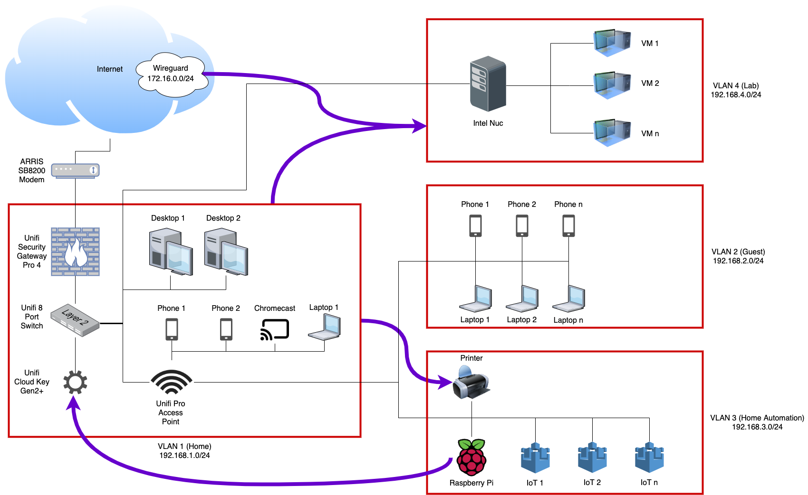

This repo is about my home network, its setup, and how you can recreate it or a similar one. I learned a lot from trial and error in the processing of building it so I hope to teach you some of what I know!

I tried to break things down in a way that makes sense, so the depending on what you're trying to do, please see the relevant markdown file.

# My network in a picture

# My network in words

- VLAN1
  - Unifi Security Gateway
  - Unifi Switch
  - Unifi Cloud Key
  - My SO and my personal devices
- VLAN2
  - Guests who join via [my Raspberry Pi QR Code password generator / sharer](https://github.com/kmanc/wifi_qr)
- VLAN3
  - Printer
  - Google Home
  - Smart lights
  - Smart plugs
  - The Raspberry Pi that does the Guest wifi password management
  - Basically any other IOT device
- VLAN4
  - My ESXi server with a few VMs
- OpenVPN VLAN
  - Not pictured, I can VPN from my personal laptop

In general, VLANs cannot talk to each other, except for those purple arrows:
- VLAN1 can talk to VLAN4, which can communicate back when VLAN1 starts the conversation
- VLAN1 can talk to the printer, which can communicate back when VLAN1 starts the conversation
- The Raspberry Pi on VLAN3 can talk to the Cloud Key, which can communicate back when the Pi starts the conversation
- OpenVPN VLAN can talk to VLAN4, which can communicate back when the OpenVPN VLAN starts the conversation

## [General Unifi setup](https://github.com/kmanc/unifi_network_setup/blob/master/unifi.md)
- What I did on the Cloud Key so I could manage the network the way I wanted to

## [Let's Encrypt certificate on the controller](https://github.com/kmanc/unifi_network_setup/blob/master/letsencrypt.md)
- Add a certificate signed by Let's Encrypt to a Cloud Key controller so that you get the warm and fuzzy lock in your browser

## [VLANs](https://github.com/kmanc/unifi_network_setup/blob/master/vlans.md)
- Break the network out into bite sized pieces that you can manage individually

## [Firewall rules](https://github.com/kmanc/unifi_network_setup/blob/master/firewall.md)
- Define what can talk to what on the network

## [OpenVPN to a Unifi Security Gateway](https://github.com/kmanc/unifi_network_setup/blob/master/openvpn.md)
- Remote in to your home network from anywhere in the world!

