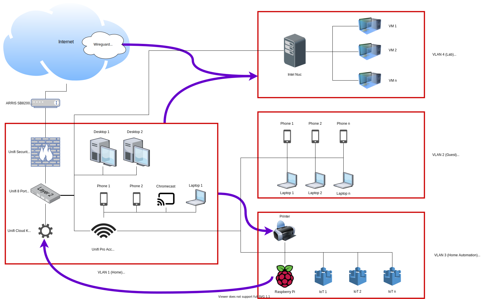

This repo is about my home network, its setup, and how you can recreate it or a similar one. I learned a lot from trial and error in the processing of building it so I hope to teach you some of what I know!

I tried to lay things out in an order that makes sense if you're starting from scratch, but if you are only interested in a specific aspect just skip ahead. Otherwise this is the order in which I set things up:

### [General Unifi setup](https://github.com/kmanc/unifi_network_setup/blob/master/unifi.md)
- What I did on the Cloud Key so I could manage the network the way I wanted to

### [Let's Encrypt certificate on the controller](https://github.com/kmanc/unifi_network_setup/blob/master/letsencrypt.md)
- Add a certificate signed by Let's Encrypt to a Cloud Key controller so that you get the warm and fuzzy lock in your browser

### [VLANs](https://github.com/kmanc/unifi_network_setup/blob/master/vlans.md)
- Break the network out into bite sized pieces that you can manage individually

### [Firewall rules](https://github.com/kmanc/unifi_network_setup/blob/master/firewall.md)
- Define what can talk to what on the network

### [Wireguard to a Unifi Security Gateway](https://github.com/kmanc/unifi_network_setup/blob/master/wireguard.md)
- Remote in to your home network from anywhere in the world!

### [Dyanmic DNS](https://github.com/kmanc/unifi_network_setup/blob/master/dynamicdns.md)
- "Name" your home with a domain so you don't have to remember an IP address

### [config.gateway.json](https://github.com/kmanc/unifi_network_setup/blob/master/config.gateway.json.md)
- Persist your changes across reboots and provisions

## My network

### My network explained

- VLAN1
  - Unifi Security Gateway
  - Unifi Switch
  - Unifi Cloud Key
  - My SO and my personal devices
  - Chromecast
- VLAN2
  - Guests who join via [my Raspberry Pi QR Code password generator / sharer](https://github.com/kmanc/wifi_qr)
- VLAN3
  - Printer
  - Google Home
  - Smart lights
  - Smart plugs
  - The Raspberry Pi that does the Guest wifi password management
  - Basically any other IOT device
- VLAN4
  - My ESXi server with a few VMs
- Wireguard VLAN
  - I can VPN from my personal laptop from anywhere on the internet to a separate VLAN

In general, VLANs cannot talk to each other, except for those purple arrows:
- VLAN1 can talk to VLAN4, which can communicate back when VLAN1 starts the conversation
- VLAN1 can talk to the printer, which can communicate back when VLAN1 starts the conversation
- The Raspberry Pi on VLAN3 can talk to the Cloud Key, which can communicate back when the Pi starts the conversation
- Wireguard VLAN can talk to VLAN4, which can communicate back when the Wireguard VLAN starts the conversation

## Proposed future state

### How it is different

- VLAN1 would be for network devices **only**
- I would poke a few more holes in the firewall to allow my personal desktop and personal laptop to manage the networking devices
- This separation is, in my opinion, a good thing as it means that devices that don't need to be able to "talk" to the network infrastructure (IE, my SO's devices, our phones, etc) cannot do so