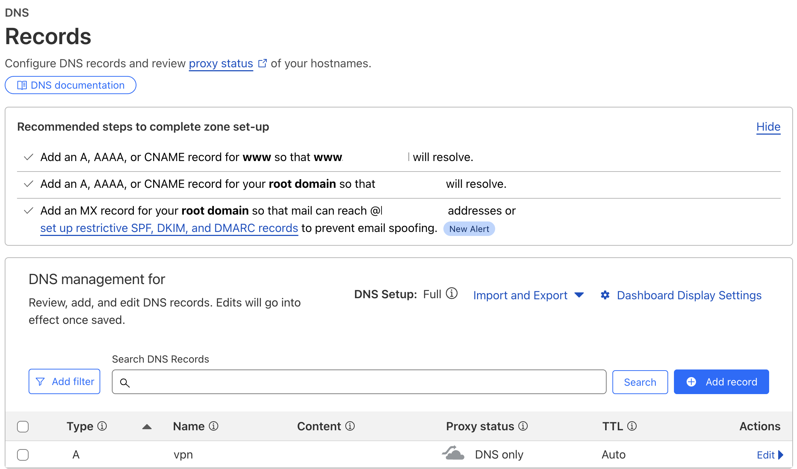
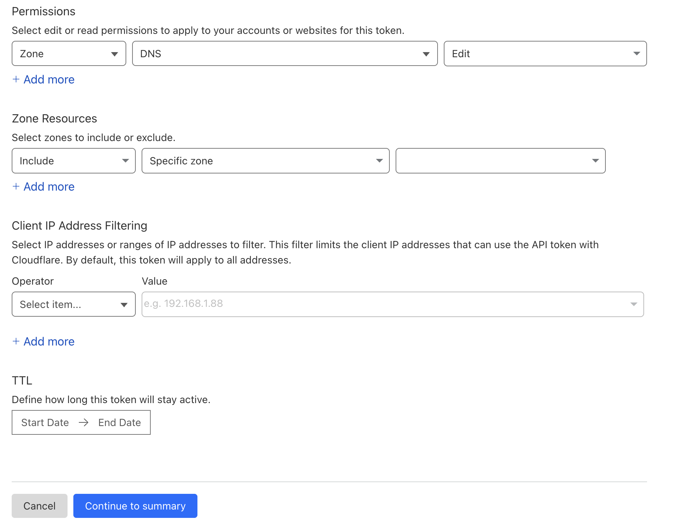
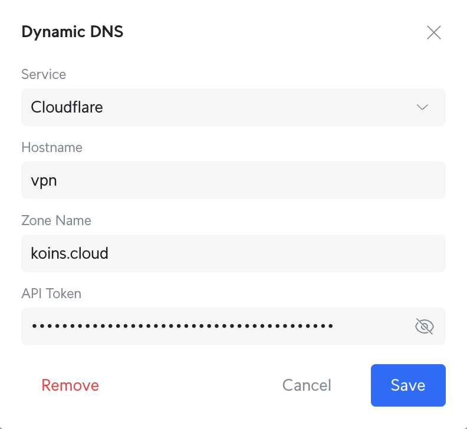

# Dynamic DNS (DDNS)

## Cloudflare

Setting up dynamic DNS is great because it allows you to always "know" where home is; giving it a name that adjusts when the IP address your ISP gives you changes means you get seamless access to home. In order to do that, I had to do some basic setup in my DNS provider (Cloudflare) first.

First, I created a DNS entry for the domain I had purchased, pointing it at a dummy IP address (like 8.8.8.8). Because of Cloudflare's settings, I had to turn off the proxy feature.

Then I created an API key that had edit rights on DNS records, and scoped it to only the record (zone) that I wanted to use for DDNS.

Last, I logged into my Unifi Cloud Key, clicked on Internet >> Primary (WAN1) >> Create New (under Dynamic DNS) and entered the information required.

---
And that's it (for now, anyway)!