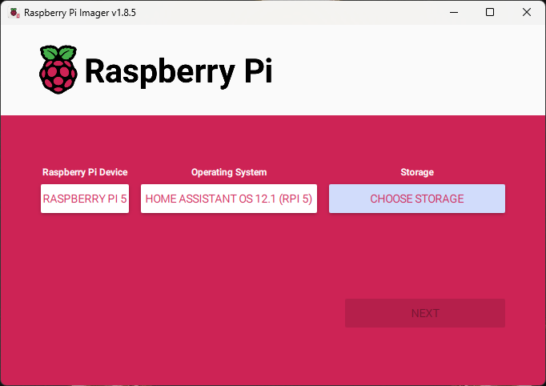
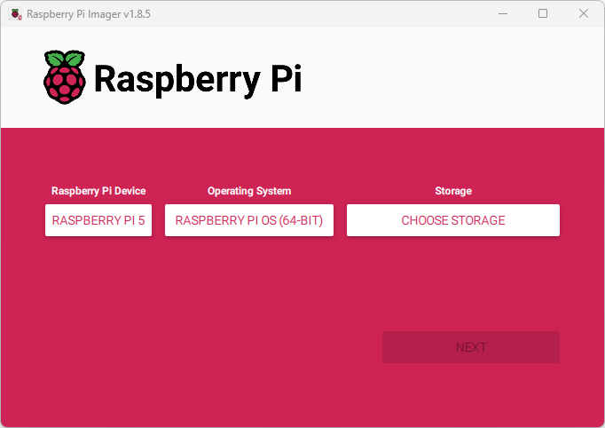
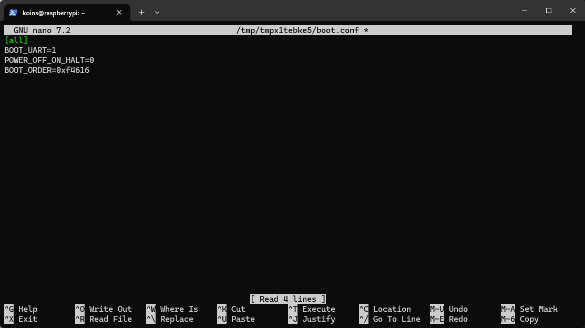
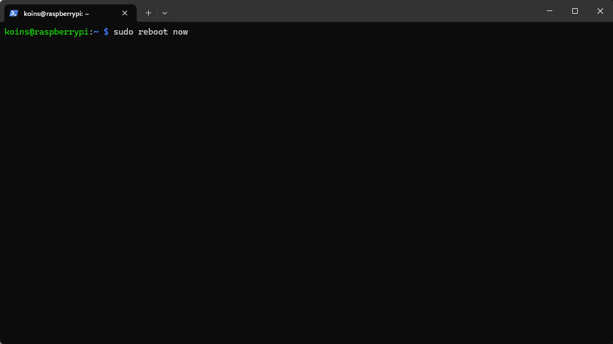
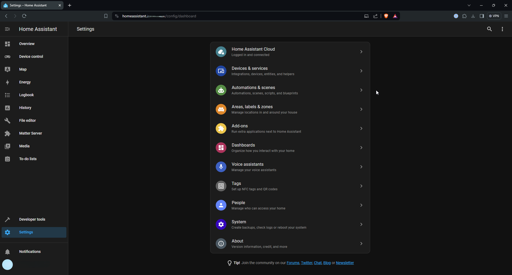
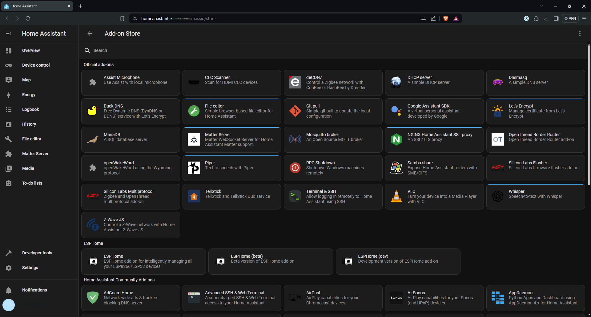
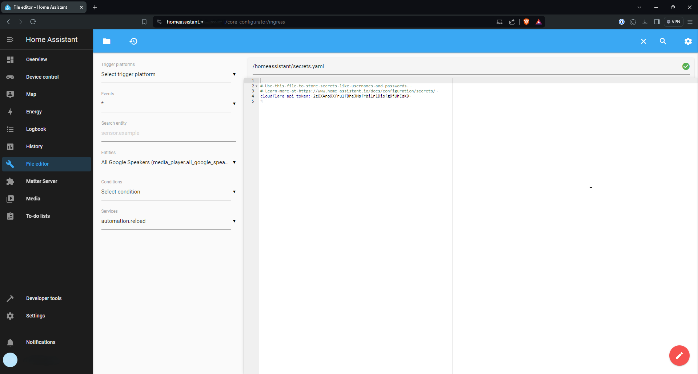
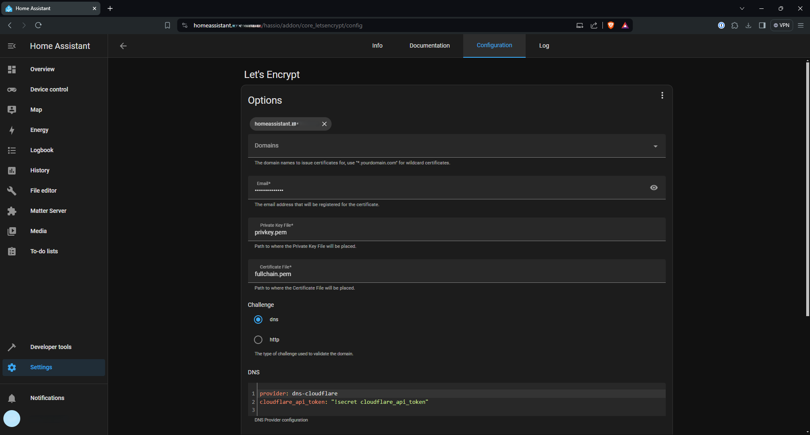

# Home Assistant

## Installation

My Home Assistant setup was a little more complicated than it probably had to be, but it wasn't that bad. The main added complexity came from the fact that I wanted to run it off a [cheap SSD](https://www.amazon.com/gp/product/B08K79T9G5) on my Raspberry Pi. Step 1 for that was installing Home Assistant on the SSD I was using.

Then I needed to tell the Pi to boot from the SSD (which was connected via a [Pineberry Pi hat](https://pineboards.io/products/hatdrive-bottom-2230-2242-2280-for-rpi5)). So I installed the Raspberry Pi OS on an SD card like I normally would.

Then I SSHed into the Pi and changed the eeprom config with the command `sudo rpi-eeprom-config --edit`.

I changed the file to read like the image below to boot from the SSD (note the 6 at the end of the boot order).

And then I rebooted the Pi, and Home Assistant was ready to go!

## Certificates

With that done, I did some basic configuration to get certificates on the Home Assistant server, starting with some Add-ons in the settings.

Specifically the two I needed were "File Explorer" and "Let's Encrypt", so I added those via the Add-on interface.

Using "File Explorer", I navigated to the "secrets.yaml" file and added my Cloudflare API key.

Then I went back to the Add-ons page, and configured Let's Encrypt to use my Cloudflare API key to get certificates for my desired FQDN.

---
[Next up, Dynamic DNS (Cloudflare)](https://kmanc.github.io/unifi_network_setup/dynamicdns.html)