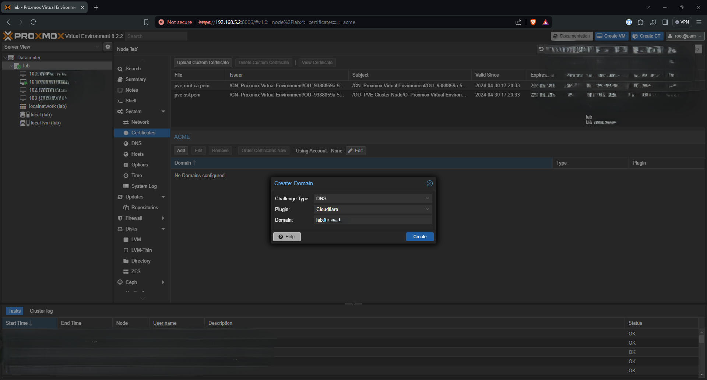

# Proxmox

All I really wanted to cover on the Proxmox side was certificates, so let's dive in. Step one is to click on "ACME" on the Proxmox Datacenter view, and add an account.

Then, just below that you'll have to fill in details for a challenge plugin - in my case that's Cloudflare using my account ID and API token.

Then, within the node under "System" there is a "Certificates" tab. Under "ACME" I added an entry for my desired FQDN.

Once that was created, I needed to make sure the "Using Account" field had the name of the account created above (in my case "Prod") showing. Then I clicked "Order Certificates Now" and let it do its thing.

---
[Next up, Home Assistant](https://kmanc.github.io/unifi_network_setup/homeassistant.html)