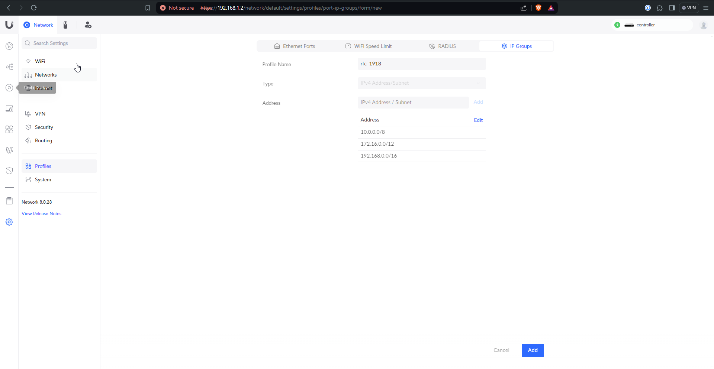

# General Unifi setup

> **Warning:** There was a time where sometimes Unifi devices had a nasty bug from fresh install. If it comes back, [see this to fix it](https://community.ui.com/questions/USG-not-advertising-default-gateway/08ac3059-d4b0-4860-889c-d69c1bd3e7e4)

First thing's first, the cloud key needs a name

After a little while of setup, the portal will be ready

I can't exactly remember the sequence of events, but I think this page either popped up or I was directed to a Unifi setup page that looked like this

Now the Cloud Key is set up and you can log in to really get going

I like to make sure that all the devices get adopted to the Cloud Key before doing anything else - if they don't a factory reset of the device or some other troubleshooting may be in order

With all that done, it's time to build the network(s) to your liking. My setup is outlined below.

## Setting up controller portal access

I chose to give my Ubiquity account local credentials to log in to my controller, which I use the majority of the time. I also created another local-only account for my Wifi QR Code project - see [its repo](https://github.com/kmanc/wifi_qr) for details. 

To do this, first click "OS Settings" tab from the main controller login page, followed by "Admins & Users". In the top right there should be a "+" sign for adding an account - click that.

Now create / edit the local account to your liking.

## Setting up device SSH access

While here, I enabled SSH for my devices because I knew I'd need it later. Under "Console Settings" there is a tick box for SSH.

## Setting up the networks (VLANs)

Now I got to work building out the networks that I knew I would want. In general I created one network for each VLAN I knew I wanted, and enabled a wifi network on the ones where devices would need to be able to connect via wifi. Under the "Network" tab, "Settings" (the gear), and then "Networks" again I created my networks.

Next up were the wifi networks, as needed.

Repeat as necessary to get your desired results.

> **Note:** If you plan on setting up Wireguard like I did, don't make your Wireguard VLAN here or you'll have to delete it later. I don't think this is the most intuitive setup, but that's just me.

## Firewall rules

In order to prevent devices that don't need connectivity to actually be able to reach each other, I prefer firewall rules to Unifi's "Traffic Rules". They create firewall rules under the hood but don't work intuitively if you ask me.

The first thing I did was plan out the IP groups I would need. These will be static assignments for devices that will have rules applied to them. Also an RFC 1918 group is helpful for preventing VLAN <--> VLAN traffic unless otherwise specified. My RFC 1918 group is shown here, but I created a bunch more for other devices.

Then actually creating the rules gets the desired network architecture. I create the RFC 1918 rule first to drop VLAN <--> VLAN by default, but then every exception that I create gets placed above it because firewalls only match the first rule that applies

## Static assignments

Then I go into the "Unifi Devices" and "Client Devices" pages and make all the static IP assignments I defined in my Firewall's IP groups. Sometimes I add local DNS records as well (shown here).

## Wireguard

Wireguard is now supported natively on Unifi! This is pretty awesome, and pretty easy to set up. Under "Settings" (gear), "VPN", I created a Wireguard server and gave it a DNS name that I will later set up Dynamic DNS (DDNS) for. I also had to define the Wireguard VLAN _here_.

After that it's just a matter of clicking through client setup options and copying the resulting config file(s) over to the client(s)

## DDNS

Setting up DDNS on the Unifi side is <easy??>

---
[Next up, Proxmox](https://kmanc.github.io/unifi_network_setup/proxmox.html)