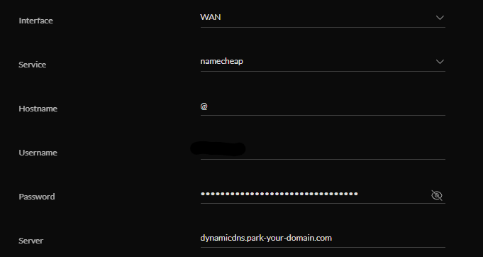

# Dynamic DNS (DDNS)

If you have a domain like I did for my peer endpoint, for bonus points you can set up Dynamic DNS for Wireguard purposes. Dyanmic DNS solves the following problem; although it doesn't happen often, your public IP address could change at any time. If it changes, you won't know where to point your Wireguard client. With Dynamic DNS you can tell your USG to tell your registrar what it's IP address is, make your domain point to that IP address, and update it if it ever changes. Then in your client Wireguard config, you can replace your IP address with the domain so that no matter what happens your VPN will always point back to your USG. Setting it up on your registrar is usually pretty easy, and configuring your USG to do it is pretty simple too (though the way Unifi names things is weird so for some registrars I found it to not be very intuitive).

First set up DDNS with your registrar for your domain. Then, from the controller UI click "Settings", "Advanced Features", "Advanced Gateway Settings". Then select "Create a New Dynamic DNS". Fill out the form as seen in the image below. Normally this is straightforward, but for my registrar (Namecheap), things get funky. The "Username" field is actually my domain, which I find super confusing. Also with most registrars you leave the "Server" field blank, but with Namecheap you need to add that one. I don't know why, but hey it works so I guess I shouldn't complain.

