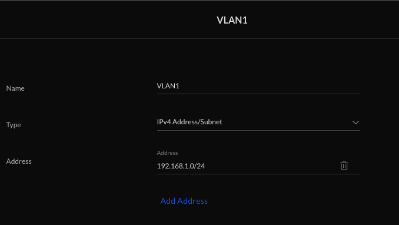
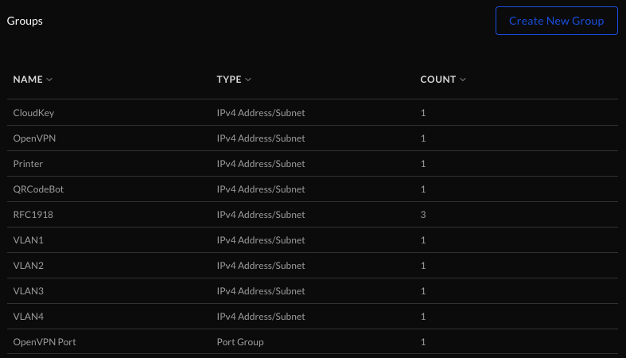
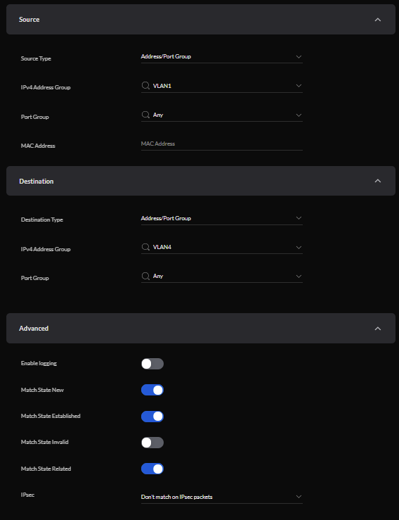
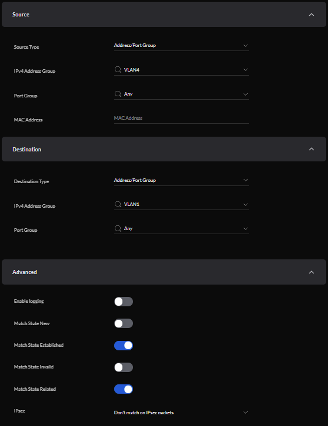
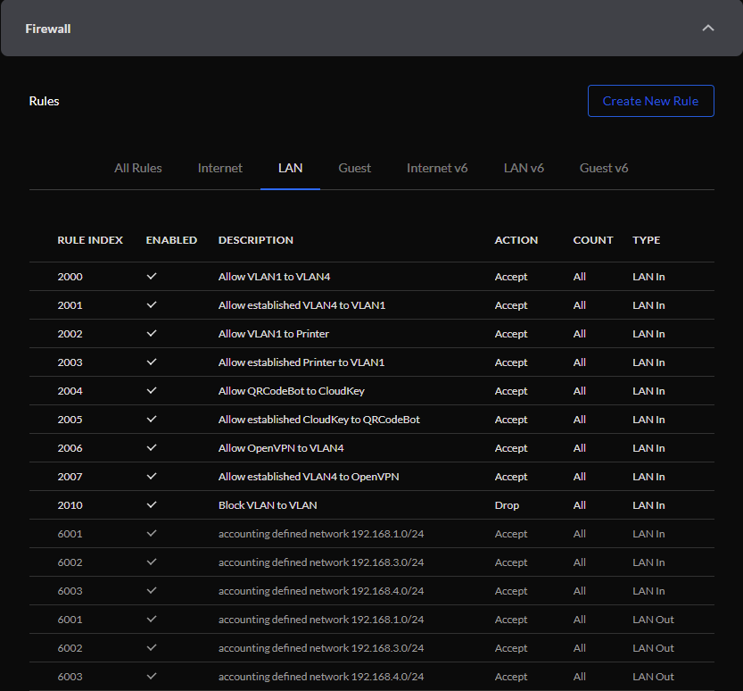
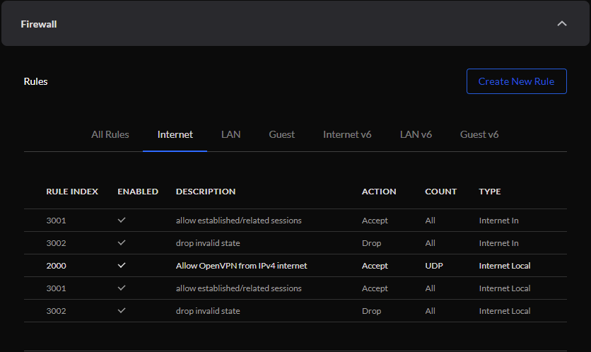
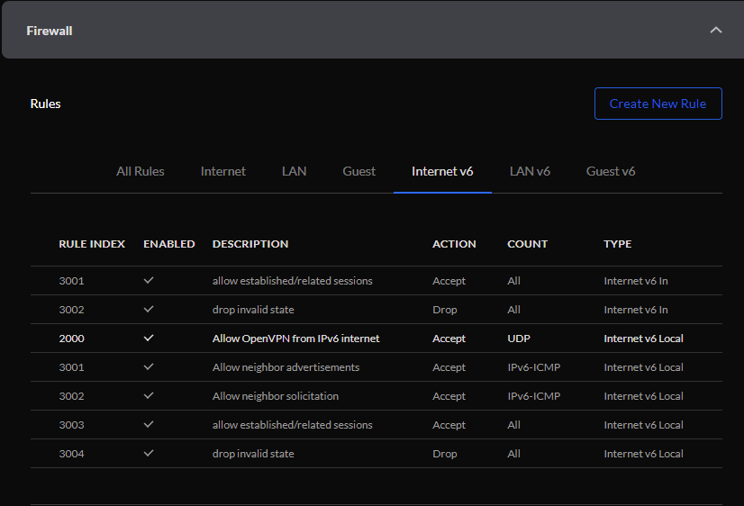

# Restricting communication

Most of the time, VLANs can't talk to each other by default. That is not true in the Unifi world; VLANs are free to communicate as they please. Although this doesn't *totally* defeat the purpose of VLANs, it does make them less useful, so we'll create the rules we need to lock down the network.

## Creating firewall groups

To make the firewalling process easier, I created a bunch of groups first. Basically any rule that I intended to create, whether it was for a single IP address or an entire range, I defined it as a group. In the controller IU, click "Settings", "Security", "Internet Threat Management", "Firewall", then scroll down a little bit and click "Create New Group". From here you can define the group as an IP address, range, port group, or whatever you intend to use to make rules later. Here's my VLAN1 example.

I repeated the process until I had a bunch of groups, which would serve as the basis for my rules. Notice that the last one is a "Port Group", not a IP address / range. This is to manage my OpenVPN rule, which I'll cover near the bottom.

## The VLAN to VLAN drop rule

Perhaps the simplest rule to create is the "block VLAN to VLAN rule". Part of the reason it is so easy is that [Unifi graciously provides documentation for it](https://help.ui.com/hc/en-us/articles/115010254227-UniFi-USG-Firewall-How-to-Disable-InterVLAN-Routing#option%202). If you follow the steps for "Option 2", your VLANs won't be able to talk to each other anymore, which is a great first step.

## Exceptions to the VLAN to VLAN drop

There are reasons that you might want to be able to break the drop rule; and that's where the firewall groups can really shine. If you remember from [the main README](https://github.com/kmanc/unifi_network_setup/blob/master/README.md), I had a few purple lines defining who could break rules in my network; let's create some.

In order to allow VLAN1 to talk to VLAN4, I created a rule that looks like the one below. Walking through it step-by-step, I created a rule for "Lan In" which basically means it's a rule for things inside my network (ie, not the internet). You can't see it in the picture, but I promise it's there. Then I defined the source of the traffic as the VLAN1 firewall group, the destination as the VLAN4 firewall group, and checked "Match State New", "Match State Established", and "Match State Related". This means that VLAN1 can begin a conversation with something on VLAN4 (the new packets), or continue any existing conversation with VLAN4 (the eastblished / related packets)

If we want to be able to do most useful things by letting VLAN1 talk to VLAN4, we also need to let VLAN4 talk back to VLAN1. We can create a nearly identical rule, swapping the source and destination groups, and leaving the "Match State New" box unchecked. This difference is important. It basically means that VLAN4 can only speak if spoken to. If a computer on VLAN1 reaches out to VLAN4, they can have a conversation and get whatever thing they wanted to do done. If, however, VLAN4 tries to start a conversation with VLAN1, the first packet (the new one) is dropped. Only existing conversations (the established / related) ones are allowed. This is actually generally how your firewall treats traffic from the outside internet. If you go to a website via its domain name in a browser and ask for things, it can give them to you. If the domain reaches out to you unsolicited, it won't be allowed to communicate.

Before we go any further, it is important to know that firewall rules execute **in order**. To get the exception rules to work, we need to click and drag them on the left hand side and drag them to be literally above the VLAN to VLAN drop rule. My rules look like this.

## Exceptions to the default internet to internal network drop

Like I mentioned in the previous section, by default the internet cannot initiate a conversation with anything in your home network. In order to allow yourself to OpenVPN in to your network, you'll need to allow an exception. In order to do that, you'll create a firewall rule for "Internet Local" (which means from the internet to the USG itself) that allows UDP on the Port Group for the OpenVPN port (1194). Once it is in the network, the previously created rules handle what it can and cannot do. 

This is what my "Internet Local" rules look like after creating the OpenVPN in rule (remember the defined destination port is the OpenVPN Port firewall group).

I replicated the rule for "Internet v6 Local" just in case I happened to VPN in from an IPv6 address, which could be more likely to happen if I was using a phone hotspot.

---
[Next up, wireguard](https://github.com/kmanc/unifi_network_setup/blob/master/wireguard.md)

