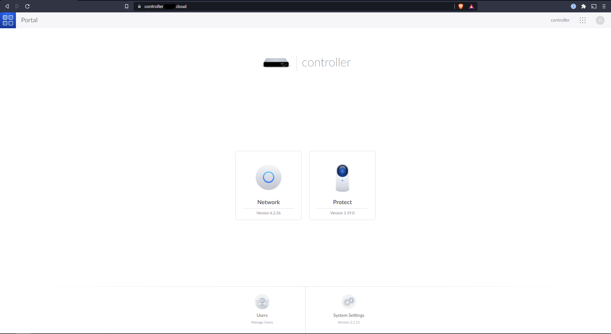

# Replace the Unifi Certificate


If you're following along from the basic setup, you can now type in the name you entered in the USG `/etc/hosts` file and see your controller pop up, but your browser might not be super happy about it. We'll replace the certificate to one signed by Let's Encrypt.


## Installing certbot


First you'll need to generate a cert, which you can do with the help of certbot. I would suggest doing what follows on a non-Unifi device; making the cert on the device you use it on feels dirty.


I did this on a Macbook, so to install I ran 


```
brew install certbot
```


## Using certbot to generate a cert


Now you'll have to generate a certificate. I should mention that in order to do this you'll need to own a domain; I have one that I use for my OpenVPN setup (covered later), so I used that. To generate the cert, you'll need to run some commands and do some things through your registrar (for me, Namecheap).


`certbot certonly --manual --preferred-challenges dns -d "*.<your_domain>"`


Then I had to create the TXT record that certbot asked me to on my registrar to prove that I own the domain. When I had done that, I waited until the following command returned the TXT record.


`dig _acme-challenge.<your_domain> txt`


Once that is done you can click enter in the certbot command line and your cert will be created.


## Move the files to the controller


Now you'll have to move the stuff that certbot created to the controller. I used SCP, so my commands looked like this


```
sudo scp /etc/letsencrypt/archive/<your_domain>/privkey.pem user@X.X.X.X:/tmp/
sudo scp /etc/letsencrypt/archive/<your_domain>/fullchain.pem user@X.X.X.X:/tmp/
sudo scp /etc/letsencrypt/archive/<your_domain>/chain.pem user@X.X.X.X:/tmp/
sudo scp /etc/letsencrypt/archive/<your_domain>/cert.pem user@X.X.X.X:/tmp/
```


## Package it all together


You need to change the format of the cert, so you need to run some commands on the controller. SSH into the controller and then run the following.


```
mkdir /data/unifi-core/config/cert_components
cd /data/unifi-core/config/cert_components
mv /tmp/*.pem .
openssl pkcs12 -export -in fullchain.pem -inkey privkey.pem -out <your_domain>.p12 -name unifi
```


You'll be asked to create a password here. You'll need that password in the next set of commands


```
keytool -importkeystore -deststorepass aircontrolenterprise -destkeypass aircontrolenterprise -destkeystore /usr/lib/unifi/data/keystore -srckeystore <your_domain>.p12 -srcstoretype PKCS12 -srcstorepass <the_password_you_created> -alias unifi
cp fullchain.pem /data/unifi-core/config/unifi-core.crt
cp privkey.pem /data/unifi-core/config/unifi-core.key
chmod 640 /data/unifi-core/config/unifi-core.*
reboot now
```


Now when you open up your controller, you shouldn't get a warning from your browser, and you should see the lock in the top middle or left hand side of the window (for me it's kinda left of middle).


