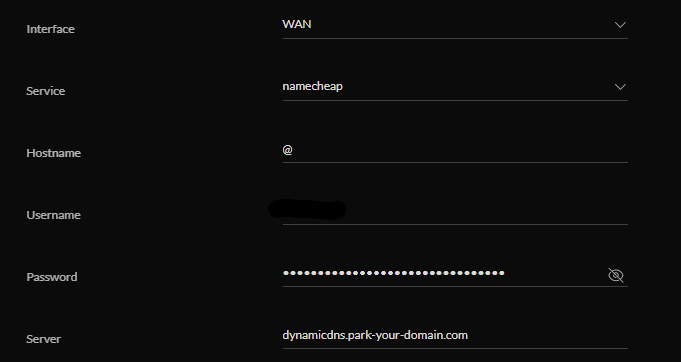

# OpenVPN to your home


Now that your network is just the way you like it, let's make sure you can access it from anywhere in the world in a secure way. Enter OpenVPN


## Certificates


In order to secure your connection to your OpenVPN server (your USG), you'll need to set up certificates for your VPN clients to authenticate themselves to your VPN server. I chose to buy a cheap SD card, install Raspberry Pi OS on it, and use it as my certificate authority. When I'm not actively managing certificates (which I don't do often), the SD card is kept in a safe place away from any of my Pis, basically making it an offline CA. Setting up my Raspberry Pi CA required me to run the following commands.

```
sudo apt install easy-rsa
sudo apt install openvpn
cd /usr/share/easy-rsa
sudo cp vars.example vars
sudo nano vars
```


I changed the "set_var" organizational fields to what I wanted, and then changed the key size to 4096. You don't *have* to do this, but I think of it as future-proofing your setup.


```
sudo ./easyrsa init-pki
sudo ./easyrsa build-ca
```


I made my "Common Name" "openvpn_ca", and then set a password for the certificate authority key


```
sudo ./easy-rsa build-server-full server nopass
sudo ./easy-rsa build-client-full <client_name>
```


Here I set a password for the client


```
sudo ./easy-rsa gen-dh
sudo mv dh.pem dh4096.pem
sudo openvpn --genkey --secret ta.key (this is another step that you don't technically need, but I chose to include)
sudo mv ta.key pki/
sudo cp -r pki/ /tmp/openvpn
cd /tmp/openvpn
sudo cp /usr/share/doc/openvpn/examples/sample-config-files/client.conf .
sudo nano client.conf
```


Your client.conf file will have a bunch of configuration options related to OpenVPN. Here's mine.


```
# Specify that we are a client and that we will be pulling certain config file directives from the server
client

# Allow the client to negotiote IP address via DHCP
float

# Use the same setting as you are using on the server
# On most systems, the VPN will not function unless you partially or fully disable the firewall for the TUN/TAP interface
;dev tap
dev tun

# Are we connecting to a TCP or UDP server?  Use the same setting as on the server
proto udp

# The hostname/IP and port of the server. You can have multiple remote entries to load balance between the servers
remote <your_public_ip_address> 1194

# Keep trying indefinitely to resolve the host name of the OpenVPN server. Useful on machines which are not permanently connected to the internet such as laptops
resolv-retry infinite

# Most clients don't need to bind to a specific local port number
nobind

# Downgrade privileges after initialization (non-Windows only)
user nobody
group nogroup

# Try to preserve some state across restarts
persist-key
persist-tun

# Wireless networks often produce a lot of duplicate packets.  Set this flag to silence duplicate packet warnings
;mute-replay-warnings

# SSL/TLS parms
ca /Users/<my_client_computer_username>/openvpn_files/ca.crt
cert /Users/<my_client_computer_username>/openvpn_files/macbook_air.crt
key /Users/<my_client_computer_username>/openvpn_files/macbook_air.key

# Verify server certificate by checking that the certicate has the correct key usage set
remote-cert-tls server

# If a tls-auth key is used on the server then every client must also have the key
tls-auth /Users/<my_client_computer_username>/openvpn_files/ta.key 1

# Force initial HMAC to use SHA256 instead of SHA1
auth SHA256

# Fallback cipher, OpenVPN is doing things differently now
# If the cipher option is used on the server then you must also specify it here
data-ciphers AES-256-CBC

# Enable compression on the VPN link
# Don't enable this unless it is also enabled in the server config file
#comp-lzo

# Set log file verbosity.
verb 3

# Don't cache credentials in memory
auth-nocache
```


You may have noticed in the "client.conf" file I referenced a bunch of files that aren't actually on my client device (yet). You'll have to copy the following files from your certificate authority to your other machines.


Your VPN client(s) will need these at the same path you defined above in the "SSL/TLS parms":
- ca.crt
- client.crt
- client.key
- client.ovpn
- ta.key


Your VPN server will need at a path you'll define in a minute (I created and then used /config/auth):
- ca.crt
- dh4096.pem
- server.crt
- server.key
- ta.key


A notes on step 1 in case you were interested:
* The dh4096.pem (Diffie-Hellman) you created determines how your server and client will exchange keys - I default to using a higher key size than necessary. It will take longer, but is mostly a one-time cost
* The ta.key file is a way to harden the security of an OpenVPN configuration. If the client and server don't have the correct ta.key, traffic will be dropped during the SSL/TLS handshake (early enough in the connection that a few categories of attacks become unfeasible)


## The OpenVPN server


Like I mentioned above, my OpenVPN server will be my Unifi USG. Because OpenVPN is not something you can use the GUI for, we'll start by SSHing into the USG, and running the following commands 

```
sudo bash
configure
edit interfaces openvpn vtun0
set mode server
set description OpenVPN
set encryption aes256
set hash sha256
set server subnet 172.16.0.0/24
set server push-route 192.168.4.0/24
set server name-server 192.168.4.1
set tls ca-cert-file /config/auth/ca.crt
set tls cert-file /config/auth/server.crt
set tls key-file /config/auth/server.key
set tls dh-file /config/auth/dh4096.pem
set openvpn-option "--tls-auth /config/auth/ta.key 0"
set openvpn-option "--user nobody"
set openvpn-option "--group nogroup"
set openvpn-option "--port 1194"
top
edit service nat rule 5001
set description "Masquerade for OpenVPN to WAN"
set outbound-interface eth0
set type masquerade
top
commit
save
exit
```


Put briefly, this allows for you to OpenVPN to home, receive an IP in the 172.16.0.0/24 range, and get a route to VLAN4, which I wanted so I could access my lab. If there are any steps you see in there that you don't need, you can skip them.


## Making the changes stick


So far so good, your USG is now an OpenVPN server that your client can connect to! The only problem is that the next time your USG provisions, it will clear all the work you did. Enter "config.gateway.json", which is basically a way to manage all of the Unifi options that the UI doesn't support. While on the USG, run the following command.

```
mca-ctrl -t dump-cfg > /tmp/config.gateway.json
```


That saves your current configuration to a file on the USG, but you'll need to move it to the controller to actually have it apply. I used SCP to move it to the controller's "/tmp" directory. Once it is on the controller, SSH into that and run the following.


```
mv /tmp/config.gateway.json /srv/unifi/data/sites/default
chown unifi:unifi /srv/unifi/data/sites/default/config.gateway.json
```


If the directory above doesn't exist you'll have to create it, but once you've done that you're all set! Even provisions won't stop your OpenVPN abilities now.


## Dynamic DNS (DDNS)


If you have a domain like I did for my controller certificate, for bonus points you can set up Dynamic DNS for OpenVPN purposes. Here's the problem; although it doesn't happen often, your public IP address could change at any time. If it changes, you won't know where to point your OpenVPN client config file. This is where DDNS can help. You can tell your USG to tell your registrar what it's IP address is, make your domain point to that IP address, and update it if it ever changes. Then in your client OpenVPN config, you can replace your IP address with the domain so that no matter what happens your VPN will always point back to your USG. Setting it up on your registrar is usually pretty easy, and configuring your USG to do it is pretty simple too (though the way Unifi names things is weird so for some registrars it's not really intuitive).


First set up DDNS with your registrar for your domain. Then, from the controller UI click "Settings", "Advanced Features", "Advanced Gateway Settings". Then select "Create a New Dynamic DNS". Fill out the form as seen in the image below. Normally this is straightforward, but for my registrar (Namecheap), things get funky. The "Username" field is actually my domain, which I find super confusing. Also with most registrars you leave the "Server" field blank, but with Namecheap you need to add that one. I don't know why, but hey it works so I guess I shouldn't complain.




