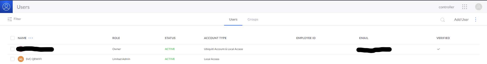
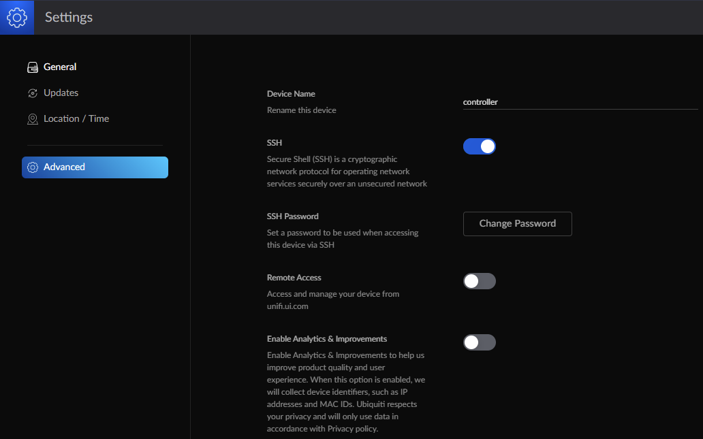
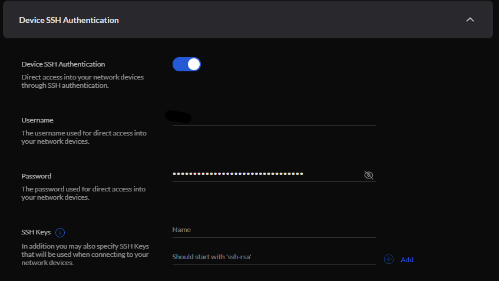

# General Unifi setup

When Unifi works on the first try I think it's great...sometimes and it doesn't and it...isn't great. When I installed my network from factory defaults, my USG could reach the internet, but my controller could not.

## Fixing a common setup bug


It turns out, some amazing human named GaryGapinski [figured out what the cause for this was, and provided some commands to fix it](https://community.ui.com/questions/USG-not-advertising-default-gateway/08ac3059-d4b0-4860-889c-d69c1bd3e7e4)


If you experience this, first SSH into the USG with the default "ubnt/ubnt" credentials, enter the following commands


```
configure
set service dhcp-server shared-network-name LAN_192.168.1.0-24 subnet 192.168.1.0/24 default-router 192.168.1.1
set service dhcp-server shared-network-name LAN_192.168.1.0-24 subnet 192.168.1.0/24 dns-server 192.168.1.1
commit
save
exit
```


And that's it! You'll actually be able to adopt your devices and get on with the rest of the network build.


## Setting up controller portal access


I chose to give my Ubiquity account local credentials to log in to my controller, and take away its remote management capability. I also created another local-only account for my Wifi QR Code project - see [its repo](https://github.com/kmanc/wifi_qr) for details. 


To do this, first click the grid dots on the upper right hand corner of controller page, the users. Hover over the pre-created user and click the dots on the right of the screen, then "Edit". Click "Profile", and create / edit the local credentials to your liking. You can also create other users if you'd like, mine looked like this when I was done.





Then click the grid dots again followed by "Settings" and "Advanced". Uncheck "Remote Access" and check "SSH", adding credentials to your liking.





## Setting up device SSH access


I wanted to be able to SSH into my USG, switch, or access point if need be.


I clicked the grid dots, then "Network". On the left, I clicked "Settings", "System Settings", "Controller Configuration", "Device SSH Authentication". Check the "Device SSH Authentication" box and add a username / password.





## Setting up the controller web portal


With the ability to SSH into my USG, I added an entry in the `/etc/hosts` file for the CloudKey's IP address. This way I could type its name in my browser and have the login portal appear.


That's all! I was pretty happy with the basic setup so I moved on to some more advanced setup.