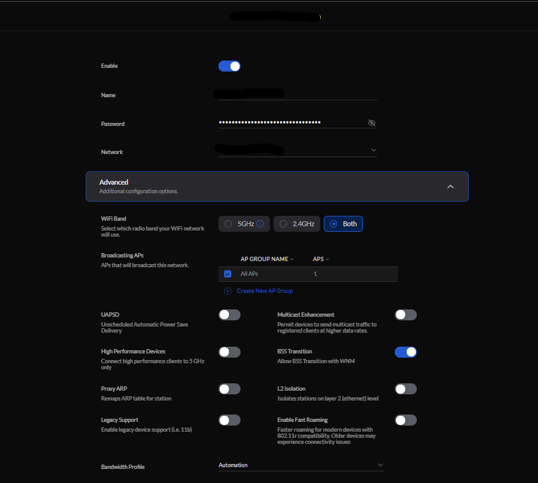
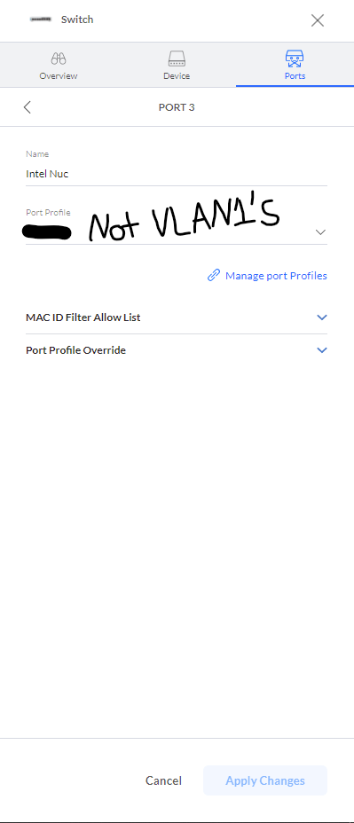

# Breaking up the network

For management reasons, breaking the network into logical chunks can make a lot of sense. I chose to set up a few separate VLANs based on what would be in them.

## Create the VLANs

Setting up the VLANs in Unifi is pretty easy. On the controller, click "Settings" on the left, then "Networks". Click "Add New Network" by the right hand side of the screen, and leave everything as default except VLAN ID. You can't choose 1 as that is default, but any other number will do. One of mine is shown below.

I repeated that process a few times, until I had something resembling this.

# Create Wifi Networks for them

You don't have to create a Wifi network for each VLAN (I didn't), but you may want to for a few. To do that, from "Settings" click "WiFi", then "Add New WiFi Network". In the "Network" section near the top, choose the VLAN you want that Wifi network to serve. For bonus points, you can add a bandwidth profile like I did at the bottom; I'll explain that in a sec.

I repeated the process until I had this.

# Bandwidth Profiles

Some networks might not have the same needs as others. For instance, I wouldn't want my guests to hog all my bandwidth, and I **definitely** don't want anything on my IOT VLAN to take any more than they need for their fairly low-effort tasks. In "Settings", "Advanced Features", you can create bandwidth profiles with speed limits for upload and download, and then apply them to Wifi networks like I did above.

# VLANs without Wifi

You may be wondering how to put a device on a VLAN that doesn't have wifi. When you create a network, a "Switch Port" is created for it automatically. While on the controller UI, you can click "Unifi Devices" on the left, followed by any switch you have added to the network. Then you can click on "Ports" near the top right, followed by any of the switch's ports, and assign it a port profile. Below is how I added my ESXi server to VLAN4 without a wifi network for VLAN4.

